# WeatherApp

- Bu proje , kullanıcının telefondaki lokasyonuna göre günlük , üç saat aralıklarla olacak şekilde saatlik ve bir haftalık hava durumu verilerini görüntülemesini sağlayan bir React Native mobil uygulamasıdır. React Native CLI olarak bare React Native kullanılmıştır.
- Kullanıcı , lokasyon iznini verdiği sürece uygulamayı kullanabilmektedir.
- Uygulamayı kullanırken internete bağlanmak zorundadır ve bu durum, anlık olarak kontrol edilmektedir.
- Kullanıcı, hava durumu bilgilerinde yer alan sıcaklık, basınç ve rüzgar hızı bilgilerini ülkesinde kullandığı birime göre değiştirebilir(Sıcaklık için celcius, fahrenheit veya kelvin seçmesi gibi).
- Kullanıcı, uygulamanın dilini değiştirebilir.
- Kullanıcı, ayarlar ekranından uygulama hakkında veya uygulamanın gizlilik politikası hakkında bilgi alabilir.

Android işletim sistemli telefonunuzda test etmek için
[linkten](./android/app/build/outputs/apk/release/app-release.apk) APK olarak indirebilirsiniz

## Ekran görüntüleri

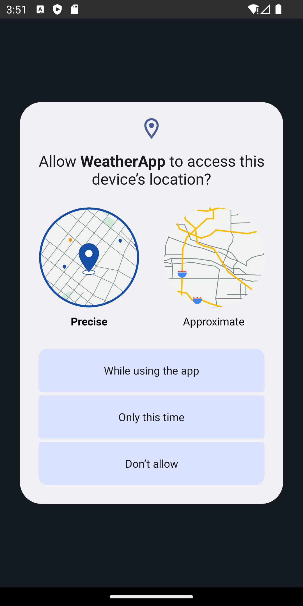

Uygulamayı kullanabilmek için konum izni sorması

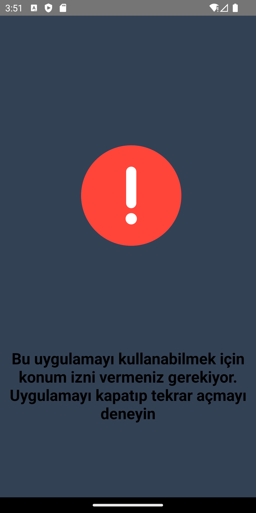

Konum izni reddedildiği taktirde hata mesajı göndermesi

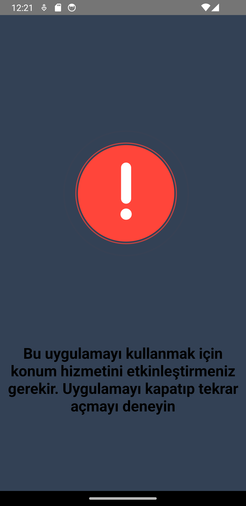

Konum iznini kabul etmesine rağmen ayarlardan konumu açmadığı taktirde hata mesajı göndermesi

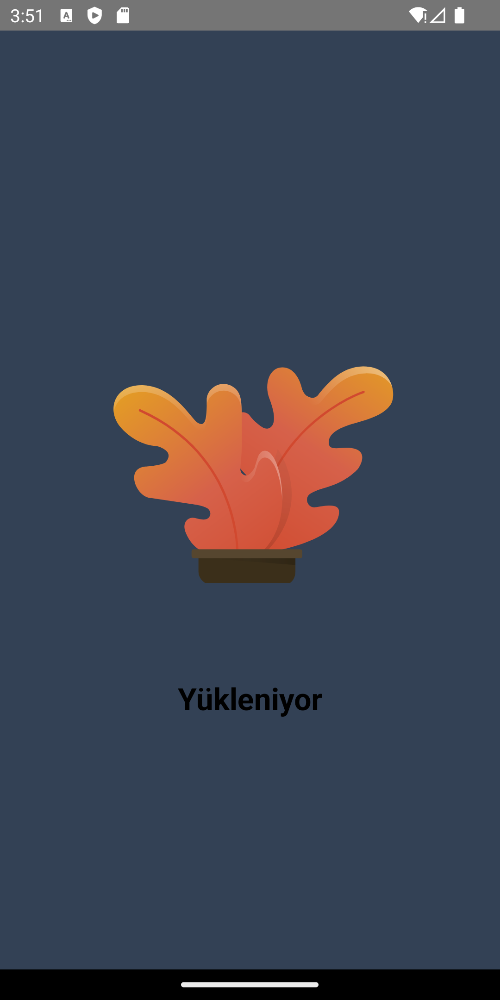

Konum izni kabul edildikten sonra API ile haberleşirken yükleme ekranı

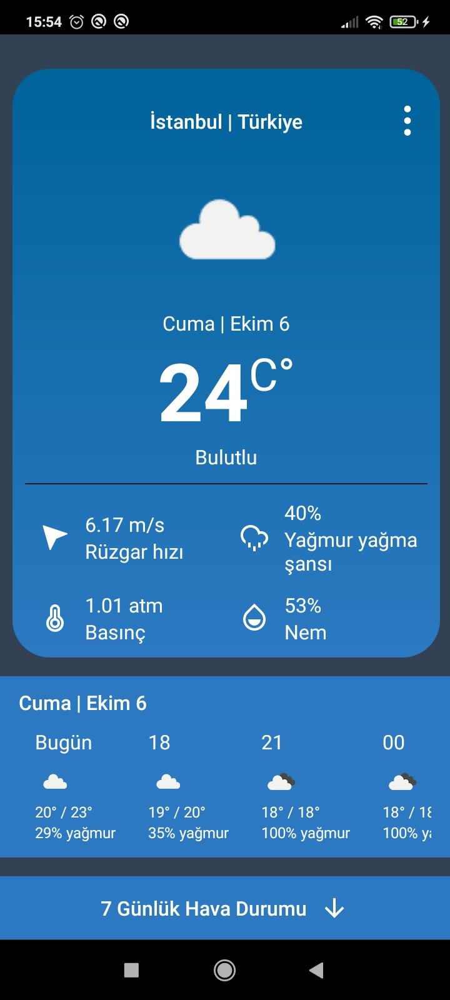

Anasayfa ekranı

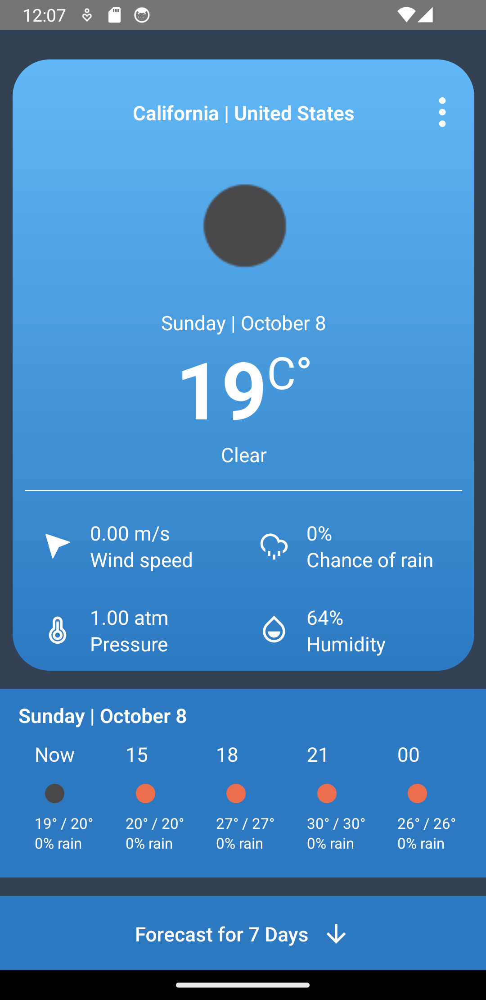

Anasayfa ekranı - İngilizce

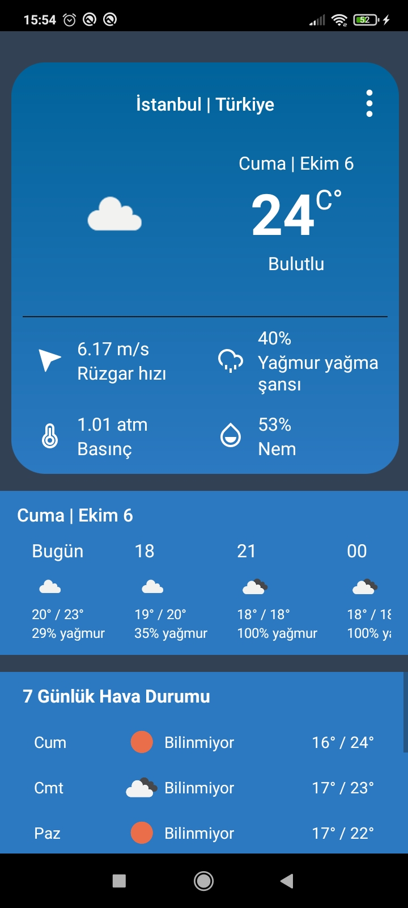

7 günlük hava durumu gösterildiğinde Anasayfa ekranı

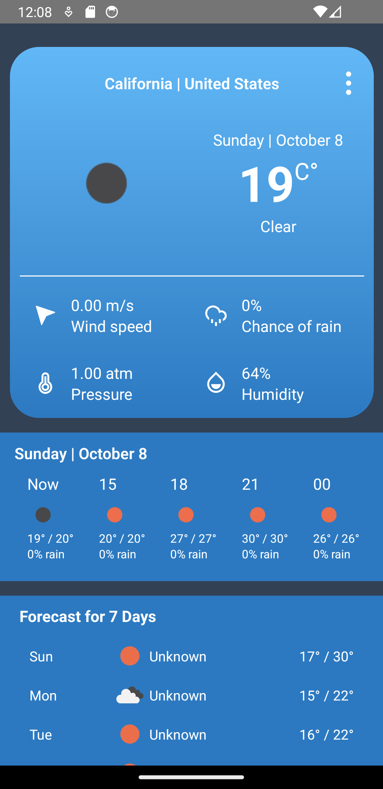

7 günlük hava durumu gösterildiğinde Anasayfa ekranı - İngilizce

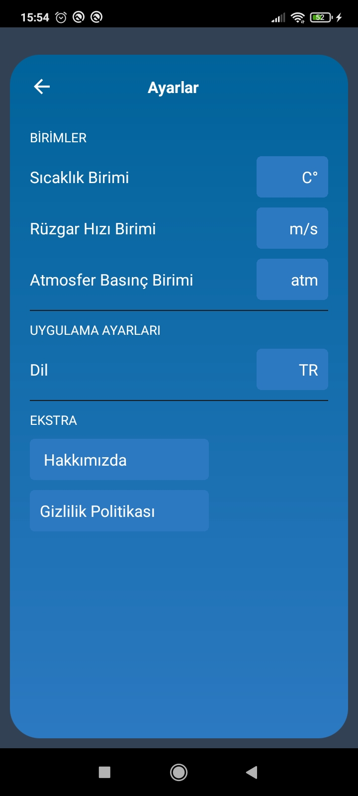

Ayarlar

Ayarlar - İngilizce

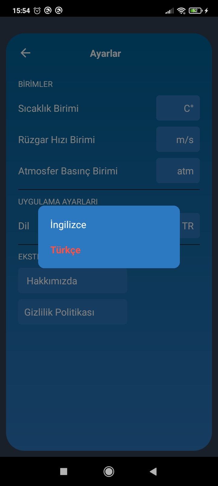

Ayarlar - Dil ayarları

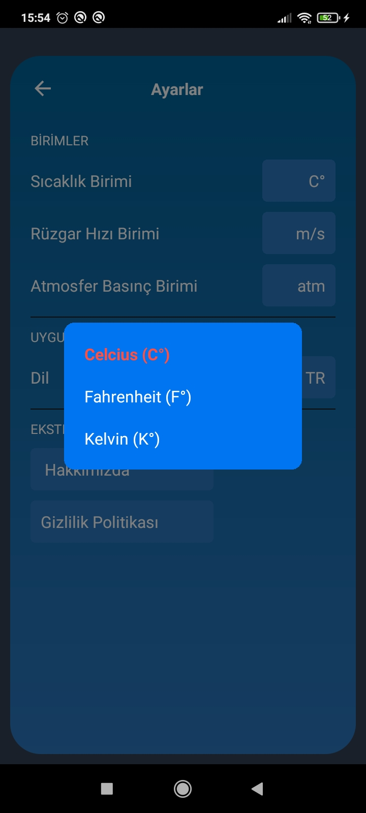

Ayarlar - Sıcaklık birim ayarları

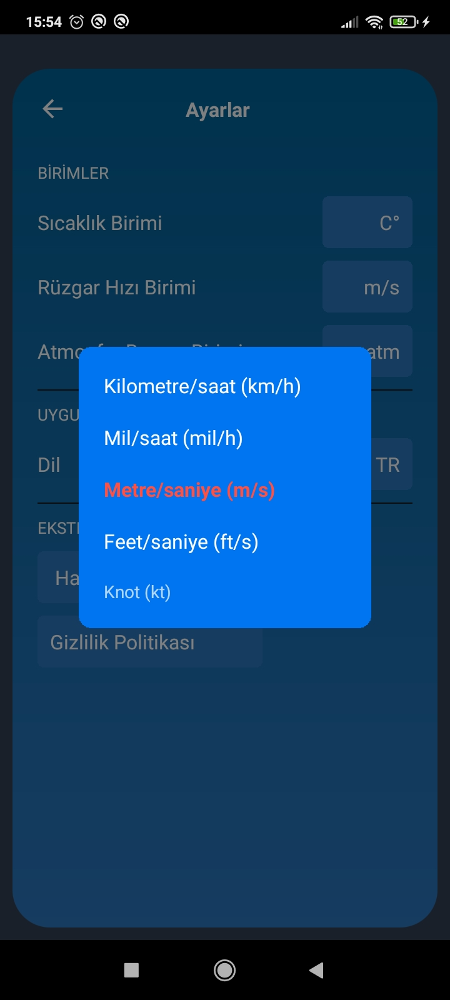

Ayarlar - Rüzgar hızı birim ayarları

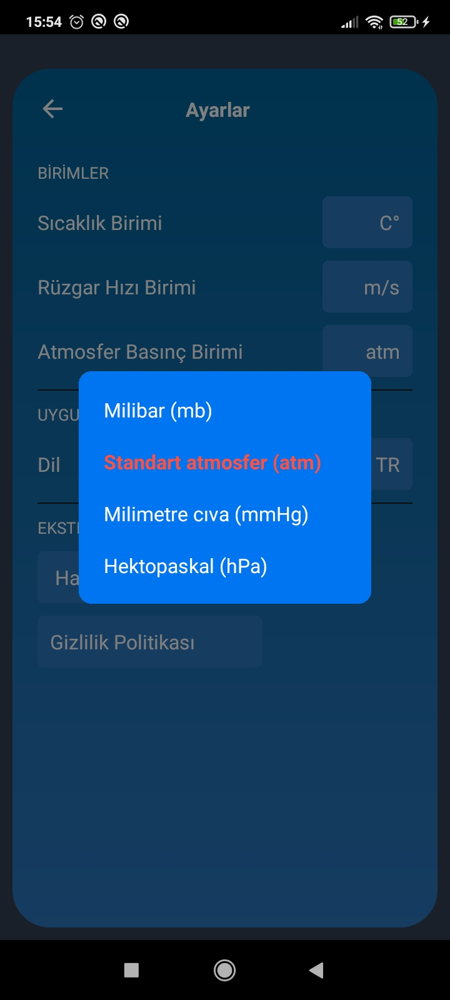

Ayarlar - Basınç birim ayarları

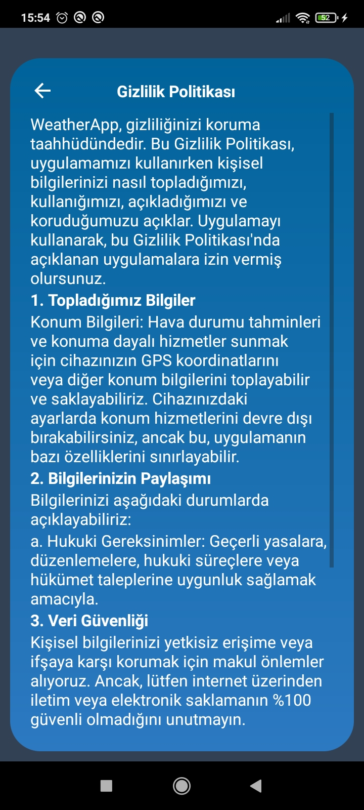

Gizlilik sözleşmesi

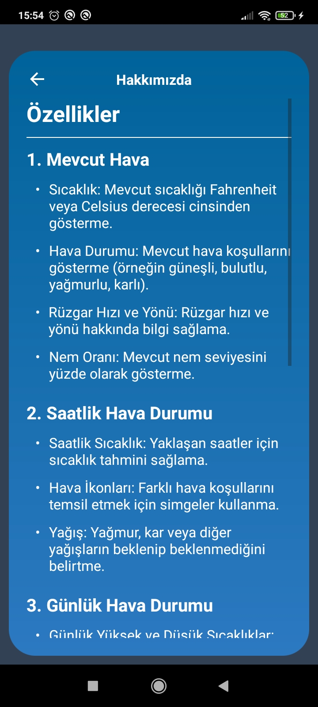

Hakkımızda

